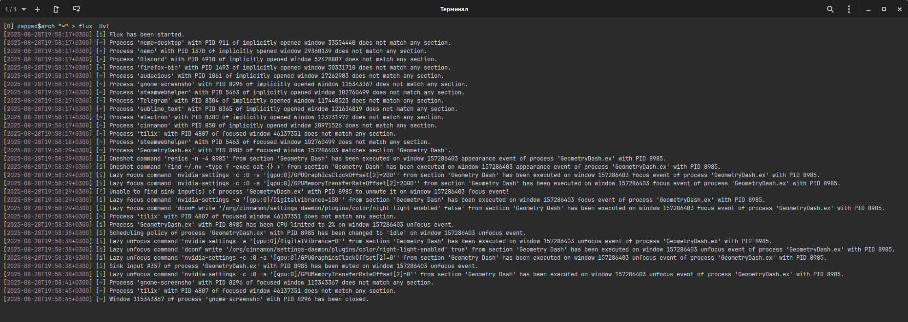

## flux
Advanced daemon for X11 desktops and window managers, designed to automatically limit FPS/CPU usage of unfocused windows and run commands on focus and unfocus events. Written in Bash and partially in C.

## Navigation
- [Known issues](#known-issues)
- [Screenshot](#screenshot)
- [Features](#features)
- [Dependencies](#dependencies)
  - [Arch Linux and derivatives](#arch-linux-and-derivatives)
  - [Debian and derivatives](#debian-and-derivatives)
  - [Void Linux and derivatives](#void-linux-and-derivatives)
  - [Fedora and derivatives](#fedora-and-derivatives)
  - [OpenSUSE Tumbleweed and derivatives](#opensuse-tumbleweed-and-derivatives)
- [Building and installation](#building-and-installation)
  - [Arch Linux and derivatives](#arch-linux-and-derivatives-1)
  - [Manual installation using release tarball](#manual-installation-using-release-tarball)
    - [Make options](#make-options)
    - [Make environment variables](#make-environment-variables)
- [Uninstallation](#uninstallation)
  - [Arch Linux and derivatives](#arch-linux-and-derivatives-2)
  - [Uninstallation using `make`](#uninstallation-using-make)
  - [Cleaning up](#cleaning-up)
- [Usage](#usage)
  - [List of available options](#list-of-available-options)
  - [Colorful output](#colorful-output)
  - [Autostart](#autostart)
- [Configuration](#configuration)
  - [Config path](#config-path)
  - [Limitations](#limitations)
  - [Available keys and description](#available-keys-and-description)
    - [Identifiers](#identifiers)
    - [Limits](#limits)
    - [Limits configuration](#limits-configuration)
    - [Scripting](#scripting)
    - [Miscellaneous](#miscellaneous)
  - [Groups](#groups)
  - [Regular expressions](#regular-expressions)
  - [Configuration example](#configuration-example)
  - [Environment variables passed to commands](#environment-variables-passed-to-commands)
- [Tips and tricks](#tips-and-tricks)
  - [Apply changes in config file](#apply-changes-in-config-file)
  - [Alternative way to mute process audio on unfocus for Pipewire with Wireplumber](#alternative-way-to-mute-process-audio-on-unfocus-for-pipewire-with-wireplumber)
  - [Increase process priority on window appearance](#increase-process-priority-on-window-appearance)
  - [Overclock NVIDIA GPU on focus](#overclock-nvidia-gpu-on-focus)
  - [Change keyboard layout to English on focus](#change-keyboard-layout-to-english-on-focus)
  - [Increase digital vibrance on focus](#increase-digital-vibrance-on-focus)
    - [NVIDIA](#nvidia)
    - [Mesa (AMD/Intel)](#mesa-amdintel)
  - [Preload shader cache on window appearance](#preload-shader-cache-on-window-appearance)
    - [NVIDIA](#nvidia-1)
    - [Mesa (AMD/Intel/NVIDIA with Nouveau)](#mesa-amdintelnvidia-with-nouveau)
  - [Disable night light on focus](#disable-night-light-on-focus)
    - [Cinnamon](#cinnamon)
    - [GNOME Shell](#gnome-shell)
    - [KDE Plasma](#kde-plasma)
- [Possible questions](#possible-questions)
  - [How does this daemon work?](#how-does-this-daemon-work)
  - [Does this daemon reduce performance?](#does-this-daemon-reduce-performance)
  - [May I get banned in game because of this daemon?](#may-i-get-banned-in-game-because-of-this-daemon)
  - [Why was this daemon developed?](#why-was-this-daemon-developed)
  - [Why code is so complicated?](#why-is-code-so-complicated)
  - [What about Wayland support?](#what-about-wayland-support)
  - [Why did you write it in Bash?](#why-did-you-write-it-in-bash)

## Known issues
- Freezing online/multiplayer games by setting `cpu-limit` to `0%` causes disconnects.
  - Use less aggressive CPU limit to allow game to send/receive packets.
- Stuttery audio in unfocused game if CPU limit is pretty aggressive.
  - That should be expected, because `cpulimit` interrupts process with `SIGSTOP` and `SIGCONT` signals very frequently to limit CPU usage. Use `mute` config key, or in case you use Pipewire with Wireplumber, you may want to use `wpctl` as described [here](#alternative-way-to-mute-process-audio-on-unfocus-for-pipewire-with-wireplumber).
- In some games, with `focus-grab-cursor` set to `true`, cursor still able to escape, but does not work outside of window. As example - "Ori and the Will of the Wisps" game on Unity engine in windowed mode.
  - Whether do not use `focus-grab-cursor` config key in such cases or ignore an issue, I can not do anything with this.
- Daemon says that it waits for cursor ungrab "without any reason". That may happen in case game grabs cursor manually.
  - Do not use `focus-grab-cursor` config key in such cases, as it becomes useless.
- Process name mismatch when using info from `--get` option. That may happen because process may change its name at runtime. For example, in "S.T.A.L.K.E.R." trilogy and its derivatives (e.g. "S.T.A.L.K.E.R.: Anomaly"), process initially starts as `xrEngine.exe`, but after engine initialization step, it changes its name to `X-Ray Primary t`. Daemon reads process name and other info once and puts it into associative arrays to reduce CPU usage and improve performance. As a result, if daemon detects process during initialization step, it will continue to associate it with this old name. However, if daemon becomes restarted with `--hot` option after name has been changed, it will now detect updated name, which will match with what is returned by `--get`.
  - Use regular expressions in `name` (`~=`) config key, e.g. `^('X-RAY Primary t'|'xrEngine.exe'|'AnomalyDX11AVX.'|'XR_3DA.exe')$`. You may want to start daemon in verbose mode to find message about mismatch containing process name catched at engine initialization step.
- Daemon mutes multiple processes if there is >=2 processes with the same name.
  - That happens in case processes do not report their PIDs, so daemon should guess. If you use Pipewire with Wireplumber, you may want to use [this](#alternative-way-to-mute-process-audio-on-unfocus-for-pipewire-with-wireplumber) method. Keep in mind, this method does not mute processes in sandboxes with PID namespaces, unlike default one.

## Screenshot

*Daemon running with handling already opened windows (`-H`) in verbose mode (`-v`) and enabled timestamps (`-t`)*

## Features
- Apply CPU or FPS limit to process on unfocus and unlimit on focus. FPS limiting requires game running using MangoHud with already existing config file.
- Reduce process priority on unfocus and restore it on focus.
- Minimize window on unfocus, useful for borderless windows.
- Expand window to fullscreen on focus, useful for games which handle a window mode in weird way, e.g. Forza Horizon 4 changes its mode to windowed after minimization.
- Grab cursor and redirect input into focused window, that prevents cursor from escaping to second monitor in case with borderless windows.
- Execute commands and scripts on focus, unfocus and window closure events to extend daemon functionality. Daemon provides info about window and process through environment variables.
- Logging support.
- Notifications support.
- Flexible identifiers support to avoid false positives, including regular expressions.
- Works with processes running through sandbox with PID namespaces, e.g. Firejail.
- Handles DE/WM restart or switching it on the fly.
- Supports most of X11 DEs/WMs ([EWMH-compatible ones](https://specifications.freedesktop.org/wm-spec/latest/)) and does not rely on neither GPU nor its driver.
- Detects and handles both explicitly and implicitly opened windows (appeared with and without focus event respectively).
- Mute processes on unfocus and unmute on focus. Supports Pulseaudio and Pipewire (including Pipewire Media Session and Wireplumber).

## Dependencies
### Arch Linux and derivatives
**Required:** `bash` `util-linux` `cpulimit` `coreutils` `libxres` `libx11` `libxext` `xorgproto` `less`

**Optional:** `mangohud` `lib32-mangohud` `libnotify` `libpulse`

**Build:** `libxres` `libx11` `libxext` `xorgproto` `make` `gcc`

### Debian and derivatives
**Required:** `bash` `cpulimit` `coreutils` `libxres1` `libx11-6` `libxext6` `less`

**Optional:** `mangohud` `mangohud:i386` `libnotify-bin` `pulseaudio-utils`

**Build:** `libxres-dev` `libx11-dev` `libxext-dev` `x11proto-dev` `make` `gcc`

### Void Linux and derivatives
**Required:** `bash` `util-linux` `cpulimit` `coreutils` `libXres` `libX11` `libXext` `xorgproto` `less`

**Optional:** `MangoHud` `MangoHud-32bit` `libnotify` `pulseaudio-utils`

**Build:** `libXres-devel` `libX11-devel` `libXext-devel` `xorgproto` `make` `gcc`

### Fedora and derivatives
**Required:** `bash` `util-linux` `cpulimit` `coreutils` `libXres` `libX11` `libXext` `less`

**Optional:** `mangohud` `mangohud.i686` `libnotify` `pulseaudio-utils`

**Build:** `libXres-devel` `libX11-devel` `libXext-devel` `xorg-x11-proto-devel` `make` `gcc`

### OpenSUSE Tumbleweed and derivatives
**Required:** `bash` `util-linux` `cpulimit` `coreutils` `libXRes1` `libX11-6` `libXext6` `less`

**Optional:** `mangohud` `mangohud-32bit` `libnotify4` `pulseaudio-utils`

**Build:** `libXres-devel` `libX11-devel` `libXext-devel` `xorgproto-devel` `make` `gcc`

## Building and installation
### Arch Linux and derivatives
Make sure you have installed `base-devel` package before continue.

#### Install `cpulimit` dependency from AUR
```bash
git clone 'https://aur.archlinux.org/cpulimit.git' && cd 'cpulimit' && makepkg -sric && cd ..
```

#### Clone this repository and use PKGBUILD to install daemon
```bash
git clone https://github.com/itz-me-zappex/flux.git && cd flux/packaging/archlinux && makepkg -sric
```

#### Add user to `flux` group to bypass limitations related to changing scheduling policies
```bash
sudo usermod -aG flux "$USER"
```

### Manual installation using release tarball
Use this method if you use other distro. Make sure you have installed dependencies as described [here](#dependencies) before continue.

#### Make options
| Option | Description |
|--------|-------------|
| `clean` | Remove `build/` in repository directory with all files created there after `make`. |
| `install` | Install daemon to prefix, can be changed using `$PREFIX`, defaults to `/usr/local`. |
| `uninstall` | Remove `bin/flux` and `lib/flux/` from prefix, can be changed using `$PREFIX`, defaults to `/usr/local`. |

#### Make environment variables
| Variable | Description |
|----------|-------------|
| `PREFIX` | Install daemon to `<PREFIX>/bin/` and `<PREFIX>/lib/flux/`, defaults to `/usr/local`. |
| `CC` | C compiler, defaults to `gcc`. |
| `CFLAGS` | C compiler options, defaults to `-O2 -s`. |

#### Download latest release with source
```bash
wget -qO- 'https://api.github.com/repos/itz-me-zappex/flux/releases/latest' | grep '"tarball_url":' | cut -d '"' -f 4 | xargs wget -O flux.tar.gz
```

#### Extract archive and change directory
```bash
tar -xvf flux.tar.gz --one-top-level=flux --strip-components=1 && cd 'flux'
```

#### Build daemon
```bash
make
```

#### Install daemon to `/usr/local`
```bash
sudo make install
```

#### Or you may want to change prefix e.g. in case you want install it locally
```bash
PREFIX="~/.local" make install
```

#### Or you may want to keep daemon and modules in single directory, that will work, just
```bash
./build/flux -h
```

#### Create `flux` group, needed to bypass scheduling policies change limitations
```bash
sudo groupadd -r flux
```

#### Add current user to `flux` group
```bash
sudo usermod -aG flux "$USER"
```

## Uninstallation
### Arch Linux and derivatives
#### Execute following
```bash
sudo pacman -Rnsc flux
```

### Uninstallation using `make`
#### Download release archive with currently installed version and extract it, e.g
```bash
wget 'https://github.com/itz-me-zappex/flux/archive/refs/tags/v1.23.4.tar.gz' && tar -xvf 'v1.23.4.tar.gz' && cd 'flux-1.23.4'
```

#### Uninstall daemon from `/usr/local`
```bash
sudo make uninstall
```

#### Or, if it was installed somewhere else, e.g. in `/usr`, then
```bash
sudo PREFIX='/usr' make uninstall
```

#### Remove unneeded dependencies
Depends by distro and package manager you use, I highly suggest to remove dependencies selectively and check which packages are use it to avoid system breakage.

### Cleaning up
#### Temporary directory (after crash)
```bash
rm -rf '/tmp/flux'
```

#### Config file (if not needed anymore), e.g.
```bash
rm ~/.config/flux.ini
```

#### Remove group from system
```bash
sudo groupdel flux
```

## Usage
### List of available options
```
Usage: flux [-C <mode>] [-c <file>] [-g <method>] [-l <file>] [-T <format>] [-Pe/-Pi/-Pv/-Pw <text>] [options]

Options and values:
  -C, --color <mode>                  Color mode, either 'always', 'auto' or 'never'
                                      default: auto
  -c, --config <file>                 Change path to config file
                                      default: 1) $XDG_CONFIG_HOME/flux.ini
                                               2) $HOME/.config/flux.ini
                                               3) /etc/flux.ini
  -g, --get <method>                  Display window process info and exit, method either 'focus' or 'pick'
  -h, --help                          Display this help and exit
  -H, --hot                           Apply actions to already unfocused windows before handling events
  -l, --log <file>                    Enable logging and set path to log file
  -L, --log-overwrite                 Recreate log file before start, depends on '--log' option
  -n, --notifications                 Display messages as notifications
  -q, --quiet                         Display errors and warnings only
  -T, --timestamp-format <format>     Set timestamp format, depends on '--timestamps' option
                                      default: [%Y-%m-%dT%H:%M:%S%z]
  -t, --timestamps                    Include timestamps in messages
  -u, --usage                         Alias for '--help'
  -v, --verbose                       Detailed output
  -V, --version                       Display release information and exit

Prefixes configuration:
  -Pe, --prefix-error <text>          Change prefix for error messages
                                      default: [x]
  -Pi, --prefix-info <text>           Change prefix for info messages
                                      default: [i]
  -Pv, --prefix-verbose <text>        Change prefix for verbose messages
                                      default: [~]
  -Pw, --prefix-warning <text>        Change prefix for warning messages
                                      default: [!]

Examples:
  flux -Hvt
  flux -HtLl ~/.flux.log -T '[%d.%m.%Y %H:%M:%S]'
  flux -ql ~/.flux.log
  flux -c ~/.config/flux.ini.bak
  flux -tT '(\e[1;4;36m%d.%m.%Y\e[0m \e[1;4;31m%H:%M:%S\e[0m)'
```

### Colorful output
Daemon supports colors in prefixes and timestamps, those are configurable and I did everything to prevent user from shooting into his third "leg". There is a bunch of logic implemented to avoid that:
  - Daemon will not interpret anything but ANSI escape sequences (e.g. `\e[31mHello, world!\e[0m`), so output breakage because of something like `\n` or `\r` simply impossible, those are just shown as text.
  - Daemon adds additional `\e[0m` to end of prefix/timestamp, that prevents output breakage by isolating formatting inside variables.
  - Even if timestamp/prefix specified by user contains ANSI escape sequences, daemon still removes those keeping only text if output becomes redirected or if `--color` forced to `none`.

To configure colors in custom prefix/timestamp, you need to use ANSI escape sequence inside of prefix/timestamp as specified below:
```bash
flux -tT '(\e[1;4;36m%d.%m.%Y\e[0m \e[1;4;31m%H:%M:%S\e[0m)'
```

Now you have timestamp with bold and underlined text with cyan date and red time. Order or count of ANSI escape sequences does not matter, so you can turn timestamps into freaking rainbow without causing explosion of the Sun. Same is applicable to prefixes. If you do not like `\e` for whatever reason, you can use either `\033`, `\u001b` or `\x1b` instead, those are handled registry independently. More about colors and ANSI escape sequences you can find on `https://www.shellhacks.com/bash-colors` or on another website.

### Autostart
Just add command to autostart using your DE/WM settings. Running daemon as root also possible, but that feature almost useless.

## Configuration
A simple INI is used for configuration.

### Config path
Daemon searches for following configuration files by priority:
- `$XDG_CONFIG_HOME/flux.ini`
- `$HOME/.config/flux.ini`
- `/etc/flux.ini`

### Limitations
As INI is not standartized, I should mention all supported features here.

**Supported:**
- Spaces and other symbols in section names.
- Single and double quoted strings.
- Сase insensitivity of key names.
- Comments (using `;` and/or `#` symbols).
- Insensetivity to spaces before and after `=` symbol.
- Appending values to config keys using `+=`. Works only in `exec-oneshot`, `exec-focus`, `exec-unfocus`, `lazy-exec-focus` and `lazy-exec-unfocus` config keys.
- Regular expressions using `~=`. Works only in `name`, `command` and `owner` config keys.

**Unsupported:**
- Line continuation.
- Inline comments.
- Anything else that unmentioned here.

### Available keys and description
#### Identifiers
| Key | Description |
|-----|-------------|
| `command` | Command which is used to execute process, required if `name` is not specified. |
| `name` | Name of process, required if `command` is not specified. Daemon uses soft match for processes with names which have length 15 symbols (not including 16th `\n`), i.e. probably stripped. |
| `owner` | Effective UID of process or username (login), optional. |

#### Limits
| Key | Description |
|-----|-------------|
| `cpu-limit` | CPU limit to set on unfocus event, accepts values between `0%` and `100%` (no limit), `%` symbol is optional. Defaults to `100%`. |
| `fps-unfocus` | FPS to set on unfocus, required by and requires `mangohud-config`, cannot be equal to `0` as that means no limit. |
| `fps-focus` | FPS to set on focus or list of comma-separated integers (e.g. `30,60,120`, used in MangoHud as FPS limits you can switch between using built-in keybinding), requires `fps-unfocus`. Defaults to `0` (i.e. no limit). |
| `idle` | Boolean, set `SCHED_IDLE` scheduling policy for process on unfocus event to greatly reduce its priority. Daemon should run as `@flux` to be able restore `SCHED_RR`/`SCHED_FIFO`/`SCHED_OTHER`/`SCHED_BATCH` scheduling policy and only as root to restore `SCHED_DEADLINE` scheduling policy (if daemon does not have sufficient rights to restore these scheduling policies, it will print warning and will not change anything). Defaults to `false`. |
| `mute` | Boolean, daemon mutes process on unfocus and unmutes on focus events. Uses `pactl` tool with a bunch of logic to parse list of sink inputs and find match using only process name and PID. Defaults to `false`. You may want to use [alternative](#alternative-way-to-mute-process-audio-on-unfocus-for-pipewire-with-wireplumber) way to mute process in case you use Pipewire with Wireplumber. |

#### Limits configuration
| Key | Description |
|-----|-------------|
| `delay` | Delay in seconds before applying CPU/FPS limit and setting `SCHED_IDLE`. Defaults to `0`, supports values with floating point. |
| `mangohud-source-config` | Path to MangoHud config which should be used as a base before apply FPS limit in `mangohud-config`, if not specified, then target behaves as source. Useful if you not looking for duplicate MangoHud config for multiple games. |
| `mangohud-config` | Path to MangoHud config which should be changed (target), required if you want change FPS limits and requires `fps-unfocus`. Make sure you created specified config, at least just keep it blank, otherwise MangoHud will not be able to load new config on fly and daemon will throw warnings related to config absence. Do not use the same config for multiple sections! |
| `group` | Specify group from which section suppossed to inherit rules. Group declaration should begin with `@` symbol in both its section name and in value of `group` key. |

#### Scripting
| Key | Description |
|-----|-------------|
| `exec-oneshot` | Command to execute on window appearance event, command runs via bash using `nohup setsid` and will not be killed on daemon exit, output is hidden to avoid mess. |
| `exec-closure` | Command to execute on window closure event, command runs via bash using `nohup setsid` and will not be killed on daemon exit, output is hidden to avoid mess. Defaults to `lazy-exec-unfocus` value if not specified or declared with `+=` (appending). |
| `exec-exit` | Command to execute when daemon receives `SIGINT` or `SIGTERM` signal, command runs via bash using `nohup setsid` and will not be killed on daemon exit, output is hidden to avoid mess. Defaults to `lazy-exec-unfocus` value if not specified or declared with `+=` (appending). |
| `exec-exit-focus` | Same as `exec-exit`, but command appears executed only if matching window appears focused at the moment of daemon termination. |
| `exec-exit-unfocus` | Same as `exec-exit`, but command appears executed only if matching window appears unfocused at the moment of daemon termination. |
| `exec-focus` | Command to execute on focus event, command runs via bash using `nohup setsid` and will not be killed on daemon exit, output is hidden to avoid mess. |
| `exec-unfocus` | Command to execute on unfocus event, command runs via bash using `nohup setsid` and will not be killed on daemon exit, output is hidden to avoid mess. |
| `lazy-exec-focus` | Same as `exec-focus`, but command will not run when processing opened windows if `--hot` is specified or in case window appeared implicitly (w/o focus event). |
| `lazy-exec-unfocus` | Same as `exec-unfocus`, but command will not run when processing opened windows if `--hot` is specified or in case window appeared implicitly (w/o focus event). Used as `exec-exit` and/or `exec-closure` automatically if one/two of those is/are not specified. |

#### Miscellaneous
| Key | Description |
|-----|-------------|
| `unfocus-minimize` | Boolean, minimize window to panel on unfocus, useful for borderless windowed apps/games as those are not minimized automatically on `Alt+Tab`. Defaults to `false`. |
| `focus-fullscreen` | Boolean, sends X event to window manager on focus to expand window to fullscreen, useful if game (e.g. Forza Horizon 4) handles window mode in weird a way. Defaults to `false`. |
| `focus-grab-cursor` | Boolean, daemon grabs cursor if possible, binds it to window and because of X11 nature which prevents input to anything but client which owns cursor (`flux-grab-cursor` module in background in this case) - redirects all input into focused window. This ugly layer prevents cursor from escaping to second monitor in some games at cost of *possible* input lag. Cursor is ungrabbed on unfocus event. Defaults to `false`. |

### Groups
To avoid repeating yourself, reduce config file size and simplify editing, you may want to create and use groups.

Order of `group` config key matters a lot, if you want to overwrite value from group, specify key below `group = @<group>`, otherwise - above. If you want to append value to key from group, then use `+=` **after** `group` config key.

Group name does not matter, except section name should begin with `@` symbol. That is how daemon defines whether that is just a section or group.

Position of group declaration section in config file does not matter at all.

Using multiple groups in one section at the same time is not possible.

Group **should not** contain identifiers e.g. `name`, `owner` and/or `command`.

You can use `group` config key inside groups.

To make things more clear, here is an example of how to create and use groups:
```ini
[@games]
mute = true
lazy-exec-focus += nvidia-settings -a '[gpu:0]/DigitalVibrance=150'
lazy-exec-unfocus += nvidia-settings -a '[gpu:0]/DigitalVibrance=0'
exec-oneshot += renice -n -4 $FOCUSED_PID
exec-oneshot += find ~/.nv -type f -exec cat {} +

[@games-overclock]
group = @games
lazy-exec-focus += nvidia-settings -c :0 -a '[gpu:0]/GPUGraphicsClockOffset[2]=200'
lazy-exec-focus += nvidia-settings -c :0 -a '[gpu:0]/GPUMemoryTransferRateOffset[2]=2000'
lazy-exec-unfocus += nvidia-settings -c :0 -a '[gpu:0]/GPUGraphicsClockOffset[2]=0'
lazy-exec-unfocus += nvidia-settings -c :0 -a '[gpu:0]/GPUMemoryTransferRateOffset[2]=0'

[Geometry Dash]
name = GeometryDash.exe
cpu-limit = 2%
idle = true
group = @games-overclock

[Ember Knights]
name = EmberKnights_64.exe
cpu-limit = 5%
idle = true
unfocus-minimize = true
group = @games

[Alan Wake]
name = AlanWake.exe
cpu-limit = 0%
group = @games-overclock
```

### Regular expressions
To simplify config file editing and reduce its size, you may want to use regular expressions e.g. to avoid extremely long strings (like in Minecraft's command which has `java` as process name) or to make section matchable with multiple process names.

```ini
; Section matches both 'vkcube' and 'glxgears' processes
[vkcube and glxgears]
name ~= ^(vkcube|glxgears)$
cpu-limit = 0%

; Minecraft has extremely long command and process name is just 'java', so
[Minecraft]
name = java
;command = /usr/lib/jvm/java-17-openjdk/bin/java -Xms512m -Xmx8192m -Duser.language=en -Djava.library.path...minecraft-1.20.4-client.jar org.prismlauncher.EntryPoint
command ~= minecraft
cpu-limit = 5%
```

### Configuration example
```ini
; ----------------------------------------------------------------------------------------------- ;
; --- Config keys 'command' and 'owner' are optional in this case, so you can use just 'name' --- ;
; ----------------------------------------------------------------------------------------------- ;

; Freeze on unfocus and disable/enable compositor on focus and unfocus respectively
[The Witcher 3: Wild Hunt]
name = witcher3.exe
command = Z:\run\media\zappex\WD-BLUE\Games\Steam\steamapps\common\The Witcher 3\bin\x64\witcher3.exe 
owner = zappex
cpu-limit = 0%
lazy-exec-focus = killall picom
lazy-exec-unfocus = picom

; Set FPS limit to 5, minimize (as this is borderless window) and mute on unfocus, restore FPS to 60, unmute and expand to fullscreen on focus
[Forza Horizon 4]
name = ForzaHorizon4.exe
command = Z:\run\media\zappex\WD-BLUE\Games\Steam\steamapps\common\ForzaHorizon4\ForzaHorizon4.exe 
owner = zappex
mangohud-config = ~/.config/MangoHud/wine-ForzaHorizon4.conf
mangohud-source-config = ~/.config/MangoHud/MangoHud.conf
fps-unfocus = 5
fps-focus = 60
mute = true
idle = true
unfocus-minimize = true
focus-fullscreen = true

; Reduce CPU usage and reduce priority when unfocused, needed to keep game able download music and assets
[Geometry Dash]
name = GeometryDash.exe
command = Z:\run\media\zappex\WD-BLUE\Games\Steam\steamapps\common\Geometry Dash\GeometryDash.exe 
owner = zappex
cpu-limit = 2%
idle = true
```

### Environment variables passed to commands
You can use these variables in your commands and scripts that running from `exec-*` config keys to avoid obtaining window XID and process info twice.

| Variable | Description |
|----------|-------------|
| `FOCUSED_WINDOW_XID` | Decimal XID of focused window. |
| `FOCUSED_PID` | Process PID of focused window. |
| `FOCUSED_PROCESS_NAME` | Process name of focused window. |
| `FOCUSED_PROCESS_OWNER` | Effective process UID of focused window. |
| `FOCUSED_PROCESS_OWNER_USERNAME` | Effective process owner username of focused window. |
| `FOCUSED_PROCESS_COMMAND` | Command used to run process of focused window. |
| `UNFOCUSED_WINDOW_XID` | Decimal XID of unfocused window. |
| `UNFOCUSED_PID` | Process PID of unfocused window. |
| `UNFOCUSED_PROCESS_NAME` | Process name of unfocused window. |
| `UNFOCUSED_PROCESS_OWNER` | Effective process UID of unfocused window. |
| `UNFOCUSED_PROCESS_OWNER_USERNAME` | Effective process owner username of unfocused window. |
| `UNFOCUSED_PROCESS_COMMAND` | Command used to run process of unfocused window. |

## Tips and tricks
### Apply changes in config file
As daemon does not parse config on a go, you need to restart daemon with `--hot` option after config file editing to make it handle already opened windows immediately after start.

### Alternative way to mute process audio on unfocus for Pipewire with Wireplumber
This way should be faster and simplier, than using `pactl` tool with a bunch of logic as daemon does in case with `mute` config key.

But, `wpctl` tool does not mute processes which run in sandbox with PID namespaces (e.g. Firejail), and will not work without Wireplumber, so it is not applicable on Pulseaudio setups too.

Add following lines to section responsible for target:

```ini
exec-focus += wpctl set-mute -p $FOCUSED_PID 0
exec-unfocus += wpctl set-mute -p $UNFOCUSED_PID 1
```

### Increase process priority on window appearance
Niceness `-4` is fine for multimedia tasks, including games.

Add following line to section responsible for target:

```ini
exec-oneshot += renice -n -4 $FOCUSED_PID
```

### Overclock NVIDIA GPU on focus
Command from `lazy-exec-unfocus` is also executed on daemon termination if window appears focused at that moment.

Add following lines to section responsible for target (use your own values):

```ini
lazy-exec-focus += nvidia-settings -c :0 -a '[gpu:0]/GPUGraphicsClockOffset[2]=200'
lazy-exec-focus += nvidia-settings -c :0 -a '[gpu:0]/GPUMemoryTransferRateOffset[2]=2000'
lazy-exec-unfocus += nvidia-settings -c :0 -a '[gpu:0]/GPUGraphicsClockOffset[2]=0'
lazy-exec-unfocus += nvidia-settings -c :0 -a '[gpu:0]/GPUMemoryTransferRateOffset[2]=0'
```

### Change keyboard layout to English on focus
Useful for some games/apps that do not understand cyrillic letters and rely on layout instead of scancodes.

Add following lines to section responsible for target (use your own values):

```ini
lazy-exec-focus += setxkbmap us,ru,ua
lazy-exec-unfocus += setxkbmap ru,ua,us
```

### Increase digital vibrance on focus
Use `vibrant-cli` from [`libvibrant`](https://github.com/libvibrant/libvibrant) project if you use AMD or Intel GPU.

Add following lines to section responsible for target (use your own values):
#### NVIDIA
```ini
lazy-exec-focus += nvidia-settings -a '[gpu:0]/DigitalVibrance=150'
lazy-exec-unfocus += nvidia-settings -a '[gpu:0]/DigitalVibrance=0'
```

#### Mesa (AMD/Intel)
```ini
lazy-exec-focus += vibrant-cli DisplayPort-0 2.3
lazy-exec-unfocus += vibrant-cli DisplayPort-0 1
```

### Preload shader cache on window appearance
Very important if you want to improve FPS stability and get rid of stutters in games at cost of higher RAM usage.

First time (e.g. after reboot) preloading may take a lot of time, especially if shader cache folder that big as mine, but next executions will happen immediately.


*First preload command is very slow, but next execution is blazingly fast*

*P.S.: My environment has `__GL_SHADER_DISK_CACHE_PATH="$HOME/.nv"`*

That is how bufferization works, you just need to load file to memory by reading it somehow, and then kernel will not read it from disk again, relying on RAM instead.

Add following line to section responsible for target (path may vary depending on system configuration):
#### NVIDIA
```ini
exec-oneshot += find ~/.cache/nvidia -type f -exec cat {} +
```

#### Mesa (AMD/Intel/NVIDIA with Nouveau)
```ini
exec-oneshot += find ~/.cache/mesa_shader_cache_db -type f -exec cat {} +
```

### Disable night light on focus
Add following lines to section responsible for target depending on your desktop environment:
#### Cinnamon
Using `dconf`:
```ini
lazy-exec-focus += dconf write '/org/cinnamon/settings-daemon/plugins/color/night-light-enabled' false
lazy-exec-unfocus += dconf write '/org/cinnamon/settings-daemon/plugins/color/night-light-enabled' true
```

Using `gsettings`:
```ini
lazy-exec-focus += gsettings set org.cinnamon.settings-daemon.plugins.color night-light-enabled false
lazy-exec-unfocus += gsettings set org.cinnamon.settings-daemon.plugins.color night-light-enabled true
```

#### GNOME Shell
Using `dconf`:
```ini
lazy-exec-focus += dconf write '/org/gnome/settings-daemon/plugins/color/night-light-enabled' false
lazy-exec-unfocus += dconf write '/org/gnome/settings-daemon/plugins/color/night-light-enabled' true
```

Using `gsettings`:
```ini
lazy-exec-focus += gsettings set org.gnome.settings-daemon.plugins.color night-light-enabled false
lazy-exec-unfocus += gsettings set org.gnome.settings-daemon.plugins.color night-light-enabled true
```

#### KDE Plasma
Yeah, two similar commands, those work as toggle.
```ini
lazy-exec-focus += qdbus org.kde.kglobalaccel /component/kwin org.kde.kglobalaccel.Component.invokeShortcut "Toggle Night Color"
lazy-exec-unfocus += qdbus org.kde.kglobalaccel /component/kwin org.kde.kglobalaccel.Component.invokeShortcut "Toggle Night Color"
```

## Possible questions
### How does this daemon work?
- Daemon listens changes in `_NET_ACTIVE_WINDOW` and `_NET_CLIENT_LIST_STACKING` atoms, obtains window IDs and using those obtains PIDs by "asking" Xorg server via `XRes` extension, then reads info about processes from files in `/proc/<PID>` to compare it with identifiers in config file and if matching section appears, then it does specified in config file actions.

### Does this daemon reduce performance?
- Daemon uses event-based algorithm to obtain info about windows and processes, when you switching between windows daemon consumes a bit CPU time and just chills out when you doing stuff in single window. Performance loss should not be noticeable even on weak systems.

### May I get banned in game because of this daemon?
- Nowadays, anti-cheats are pure garbage, developed by freaks without balls, and you may get banned even for a wrong click or sudden mouse movement, I am not even talking about bans because of broken libs provided with games by developers themselves. But daemon by its nature should not trigger anti-cheat, anyway, I am not responsible for your actions, so use it carefully and do not write me if you got a ban.

### Why was this daemon developed?
- Main task is to reduce CPU/GPU usage of games that have been minimized. Almost every engine fails to recognize that game is unfocused and still consumes a lot of CPU and GPU resources, what can make system slow for other tasks like browsing stuff, chatting, transcoding video etc. or even unresponsive at all. With this daemon now I can simply play a game or tinker with virtual machine and then minimize window if needed without carrying about high CPU/GPU usage and suffering from low multitasking performance. Also, daemon does not care about type of software, so you can use it with everything. Inspiried by feature from NVIDIA driver for Windows where user can set FPS limit for minimized software, this tool is not exactly the same, but better than nothing.

### Why code is so complicated?
- I try to avoid using external tools in favor of bashisms to reduce CPU usage by daemon and speed up code.

### What about Wayland support?
- That is impossible, there is no any unified or even per-compositor way to read window related events and obtain PIDs of windows on Wayland. [Think twice before abandoning X11. Wayland breaks everything!](https://gist.github.com/probonopd/9feb7c20257af5dd915e3a9f2d1f2277)

### Why did you write it in Bash?
- This is (scripting) language I know pretty good, despite a fact that Bash as all interpretators works slower than compilable languages, it still fits my needs almost perfectly.
